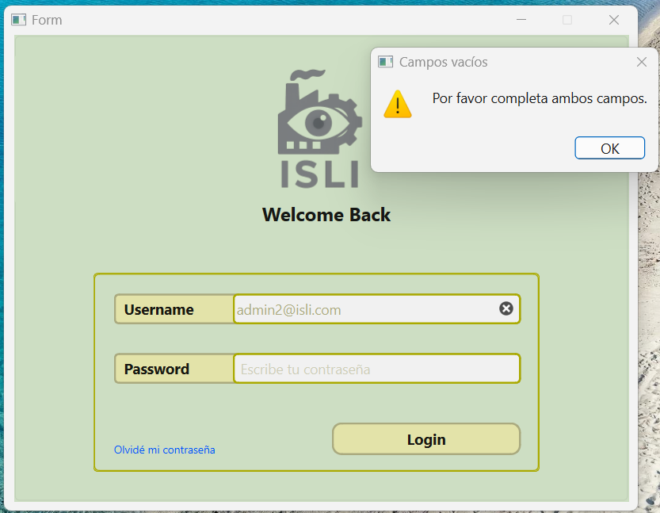

# ISLI – Sistema de Inspección de Lotes Industriales

## 📚 Índice

1. [Introducción](#1-📖-introducción)  
2. [Instalación y Requisitos](#2-⚙️-instalación-y-requisitos)  
3. [Pantalla de Inicio de Sesión](#3-🔐-pantalla-de-inicio-de-sesión)  
   - [3.1 Recuperación de contraseña](#31-recuperación-de-contraseña)  
4. [Menú Principal – Control de Calidad](#4-🏠-menú-principal--control-de-calidad)  
   - [4.1 Ejecución paso a paso del control de calidad](#41-ejecución-paso-a-paso-del-control-de-calidad)  
   - [4.2 Guardado de resultados](#42-guardado-de-resultados)  
   - [4.3 Generación de informes PDF](#43-generación-de-informes-pdf)  
5. [Histórico de Controles](#5-histórico-de-controles)  
   - [5.1 Filtrado por usuario, fecha y tolerancia](#51-filtrado-por-usuario-fecha-y-tolerancia)  
   - [5.2 Edición de comentarios](#52-edición-de-comentarios)  
   - [5.3 Visualización de informes](#53-visualización-de-informes)  
6. [Panel Lateral de Navegación](#6-panel-lateral-de-navegación)  
   - [6.1 Visualización del usuario actual](#61-visualización-del-usuario-actual)  
   - [6.2 Navegación entre ventanas](#62-navegación-entre-ventanas)  
   - [6.3 Acceso al Panel de Administración (solo administradores)](#63-acceso-al-panel-de-administración-solo-administradores)  
   - [6.4 Gestor de rutas de almacén (solo administradores)](#64-gestor-de-rutas-de-almacén-solo-administradores)  
   - [6.5 Acceso al Manual de Usuario](#65-acceso-al-manual-de-usuario)  
   - [6.6 Cierre de sesión](#66-cierre-de-sesión)  
7. [Créditos y Mantenimiento](#7-créditos-y-mantenimiento)  
8. [Preguntas Frecuentes (FAQ)](#8-preguntas-frecuentes-faq)
9. [Funcionalidades implementadas](#9-✨-funcionalidades-implementadas)  
10. [Estructura del repositorio](#10-📁-estructura-del-repositorio)

---

## 1. 📖 Introducción

**ISLI – Control de Calidad** es una aplicación de escritorio diseñada para facilitar el proceso de inspección y validación de calidad de superficies industriales planas y continuas mediante visión artificial. La herramienta puede ser útil a un amplio espectro de industrias (plásticos, maderas, textiles, entre otros ), permitiendo a los operarios:

- Cargar una carpeta con imágenes de productos o rollos capturados por un sistema de visión artificial.
- Ejecutar un análisis automatizado que detecta y mide defectos visuales, permitiendo visualizar las imágenes originales y procesadas en visores gráficos de alta calidad.
- Clasificar los resultados como "ok" o "nok" según los parámetros de tolerancia definidos por el usuario.
- Guardar los controles realizados y generar informes en formato PDF.
- Consultar un histórico completo de controles realizados, con posibilidad de filtrado, edición de comentarios y acceso a informes anteriores.

Además, incluye funcionalidades exclusivas para administradores, como el acceso al panel de control o la gestión de rutas de almacenamiento de los rollos para el análisis por lotes.

Este manual de usuario está pensado para guiar paso a paso tanto a usuarios operarios como a administradores en el uso completo de la aplicación, desde la instalación hasta la interpretación de informes.

## 2. ⚙️ Instalación y Requisitos

### Requisitos del sistema

Para ejecutar la aplicación ISLI correctamente, se recomienda cumplir con los siguientes requisitos mínimos:

- **Sistema operativo**: Windows 10 o superior
- **Procesador**: Intel i5 / AMD Ryzen 5 o superior
- **Memoria RAM**: 4 GB mínimo (se recomienda 8 GB)
- **Resolución de pantalla**: 1280x720 o superior
- **Python**: Versión 3.10 o superior
- **Dependencias**: Las bibliotecas necesarias se detallan en el requirements.txt.

---

### 📦 Instalación paso a paso

1. **Clona el repositorio** desde GitHub o descarga el proyecto en formato `.zip`:

    ```bash
    git clone https://github.com/tu-usuario/isli.git
    ```

2. **Accede al directorio del proyecto**:

    ```bash
    cd isli
    ```

3. **Crea un entorno virtual** (opcional pero recomendado):

    ```bash
    python -m venv venv
    venv\Scripts\activate  # En Windows
    ```

4. **Instala las dependencias necesarias**:

    ```bash
    pip install -r requirements.txt
    ```

---

### 🖥️ Ejecución del sistema

La aplicación ISLI consta de dos componentes principales: un **frontend de escritorio** y un **backend REST API**. Ambos deben estar en funcionamiento para una experiencia completa.

---

#### 🔹 Backend (FastAPI)

1. Abre una terminal y accede a la carpeta `backend/`:

    ```bash
    cd backend
    ```

2. Inicia el servidor ejecutando:

    ```bash
    uvicorn main:app --reload
    ```

    Esto iniciará la API REST en:

    ```
    http://127.0.0.1:8000
    ```

---

#### 🔹 Frontend (PySide6)

1. Abre otra terminal y accede al directorio del frontend:

    ```bash
    cd frontend
    ```

2. Lanza la aplicación de escritorio:

    ```bash
    python main.py
    ```

> ✅ La interfaz requiere que el backend esté activo para funciones como el login, el guardado de resultados o la obtención del siguiente ID de control.

---

### 🧩 Principales tecnologías utilizadas

| Componente        | Tecnología                          |
|-------------------|-------------------------------------|
| **Frontend**      | PySide6 (Qt for Python)             |
| **Estilo visual** | Qt Designer + layouts personalizados|
| **Backend**       | FastAPI                             |
| **Base de datos** | MySQL                               |
| **Conexión DB**   | `mysql-connector-python`            |
| **PDFs**          | `reportlab`                         |
| **Imágenes**      | `opencv-python`                     |
| **Autenticación** | JSON Web Tokens (JWT)               |
| **API HTTP**      | `requests`                          |


...

## 3. 🔐 Pantalla de Inicio de Sesión

## 3. Pantalla de Inicio de Sesión

Al iniciar la aplicación, el usuario accede a la **pantalla de login**, que es el punto de entrada al sistema. Esta interfaz permite autenticar a los usuarios registrados para acceder a las funcionalidades de la aplicación.

### 🧾 Campos requeridos

- **Correo electrónico**  
- **Contraseña**

Ambos campos son obligatorios. Si alguno está vacío o no coincide con las credenciales almacenadas, se mostrará un mensaje de error.



---

### 🔐 Validación y acceso

- Si las credenciales son válidas, el usuario será redirigido automáticamente al **menú principal** de la aplicación tras un mensaje informativo con su rol.
- Si no son correctas, se mostrará un mensaje de advertencia y se pedirá reintentar.

PANTALLAZO DE MENSAJE DE ERROR!!

---

### 👤 Roles de usuario

Existen distintos roles de usuario con diferentes niveles de acceso:

- `operario`: acceso a control de calidad, histórico, generación de informes, adición de notas en informes.
- `administrador`: acceso completo, incluyendo panel de administración y gestor de rutas.

El sistema detecta el rol automáticamente tras el login y adapta la interfaz en consecuencia (deshabilitando botones o habilitando opciones exclusivas).

---

### 🛠️ Consideraciones técnicas

- El login requiere conexión activa con el backend.
- El sistema valida los datos mediante una llamada HTTP `POST` al endpoint `/login`.
- Si la autenticación es exitosa, se almacena internamente un **token JWT**, que se utilizará para autenticar las acciones del usuario mientras dure la sesión.

### 3.1 Recuperación de contraseña

En caso de haber olvidado la contraseña, el usuario puede iniciar el proceso de restablecimiento desde la propia pantalla de inicio de sesión.

#### 🔗 Acceso al formulario

1. Haz clic en el enlace **"Olvidé mi contraseña"** ubicado debajo del formulario de login.
2. Se abrirá la ventana **"Restablecer contraseña"**.

#### 📝 Campos requeridos

- **Correo electrónico asociado a la cuenta**
- **Nueva contraseña deseada**
- **Motivo de la solicitud**

El motivo permite informar al administrador del contexto de la solicitud (por ejemplo, “cambio de equipo”, “no recuerdo la anterior”, etc.).

---

#### 🔄 Proceso de aprobación

Una vez enviado el formulario:

- La solicitud queda registrada con estado **pendiente** en el sistema.
- Cualquier administrador podrá visualizarla desde el panel de administración, donde aparecerá un **botón naranja de alerta** indicando que existe una solicitud activa.
- Al hacer clic en el botón, el administrador podrá aprobar la solicitud.
- Al aprobarla:
  - Se actualiza la contraseña en la cuenta correspondiente.
  - El estado de la solicitud pasa a **atendida**.
- El usuario podrá iniciar sesión con su nueva contraseña de forma inmediata.

---

> ⚠️ La recuperación de contraseña no es automática. Requiere la aprobación de un administrador del sistema.

## 4. 🏠 Menú Principal – Control de Calidad

Una vez que el usuario inicia sesión correctamente, accede al **menú principal** de la aplicación, desde donde se pueden gestionar los análisis de calidad sobre los rollos de imágenes disponibles.

La interfaz está dividida en diferentes zonas:

- **Parámetros de control**: configuración de tolerancias y límites.
- **Selector de rollos** (ComboBox): permite elegir la carpeta o lote a analizar.
- **Visores de imágenes**: muestran la imagen original (izquierda) y la imagen con los defectos identificados por tipo y con su área medida en mm2 (derecha).
- **Tabla de resultados**: muestra los defectos detectados en cada imagen analizada, identificando el mayor defecto encontrado y el resultado de la imagen con respecto a los umbrales de tolerancia.
- **Barra de progreso**: indica el avance del análisis.
- **Botonera de control**: iniciar control de calidad, detenerlo, reiniciar, guardar resultados, generar informe.

<!-- Requiere captura de pantalla del menú principal -->

---

### 4.1 Ejecución paso a paso del control de calidad

Para iniciar el análisis:

1. **Ajusta los parámetros**:
   - Cantidad máxima de defectos aceptables por rollo (`spinBox`)
   - Tolerancia por tamaño del defecto encontrado (`doubleSpinBox`)

2. **Selecciona un rollo** desde el ComboBox. Solo aparecerán aquellos rollos que cumplan con el criterio de <= cantidad de defectos por rollo.

3. Haz clic en el botón **"Iniciar Control de Calidad"**.

Durante el análisis:

- Se mostrarán en los visores la imagen original y su versión procesada con los defectos marcados, tipados y medidos.
- La barra de progreso avanzará conforme se vayan procesando las imágenes.
- Cada imagen procesada se añadirá como una nueva fila en la tabla de resultados.

Puedes **interrumpir** el análisis en cualquier momento con el botón correspondiente. Si finaliza completamente, se mostrará un mensaje visual de “Análisis completado”.

---

### 4.2 Guardado de resultados

Una vez completado el análisis, puedes guardar los resultados:

- Haz clic en el botón **"Guardar resultados"**.
- La aplicación enviará todos los datos al backend (incluyendo dimensiones de los defectos, clasificación y fecha).
- El sistema calculará automáticamente si el resultado del rollo es **“APTO”** o **“NO APTO”**.
- La información quedará registrada en la base de datos, y se generará un nuevo ID de control.

> ⚠️ No podrás guardar resultados si el análisis no se ha completado.

---

### 4.3 Generación de informes PDF

Después de guardar, puedes generar un **informe en PDF**:

- Haz clic en el botón **"Generar informe"**.
- El sistema creará un documento PDF con:
  - Todos los resultados del análisis
  - Detalles de las imágenes
  - Parámetros usados
  - Estado final del rollo
- El informe se guarda automáticamente en la carpeta designada en el gestor de históricos.

## 5. Histórico de Controles

Desde el menú principal, puedes acceder al **Histórico de Controles** mediante el botón correspondiente. Esta sección permite consultar todos los controles de calidad previamente realizados y registrados en la base de datos.

La interfaz está organizada como una tabla interactiva, con varias funcionalidades que facilitan la búsqueda y revisión de resultados pasados.

<!-- Requiere captura de pantalla del histórico -->

---

### 5.1 Filtrado por usuario, fecha y tolerancia

En la parte superior del histórico encontrarás opciones para **filtrar los registros** de acuerdo con distintos criterios:

- **Tolerancia por defecto**: filtra según el umbral de detección utilizado en el análisis.
- **Usuario**: permite ver solo los controles realizados por un operario específico.
- **Fecha**: restringe la búsqueda a un rango temporal concreto.

Estos filtros son combinables entre sí. Una vez aplicados, la tabla se actualizará mostrando únicamente los registros que cumplan con los criterios seleccionados.

---

### 5.2 Edición de comentarios

Cada registro del histórico puede incluir **comentarios o notas** asociadas al informe.

- Solo la columna **"Comentarios"** de la tabla es editable.
- Puedes escribir directamente en la celda correspondiente.
- Al modificar un comentario, este se guarda automáticamente en la base de datos, asociado al informe correspondiente.

> ✏️ Esta funcionalidad permite añadir observaciones adicionales después del análisis, como resultados de verificación manual o incidencias observadas.

---

### 5.3 Visualización de informes

Desde el histórico puedes acceder al informe PDF asociado a cada control y visualizarlo.

- Selecciona en la tabla el control cuyo informe deseas ver y pulsa el botón **Mostrar informe**.
- Solo podrán visualizarse informes de controles para los que los operarios hayan generado un informe tras completar un control de calidad.
- Los controles que **no disponen de informe** aparecen marcados con un **signo en rojo** en la columna **"Informe"** de la tabla.

> 📁 Todos los informes generados se almacenan en la carpeta designada por los administradores mediante el botón **Gestor de históricos**.

## 5. Panel Lateral de Navegación

En el lateral izquierdo de la aplicación encontrarás un panel fijo que permite una navegación rápida entre las diferentes secciones del sistema.

Este panel incluye información del usuario, el ID del próximo control, botones de acceso directo y opciones de cierre de sesión.

<!-- Requiere captura del panel lateral -->

---

### 5.1 Visualización del usuario actual

En la parte superior del panel se muestra:

- El **nombre del usuario** y su **rol** (`operario`, `administrador`)
- El **ID del próximo control de calidad**, calculado automáticamente

Esto permite al usuario conocer con claridad su nivel de acceso y el número correlativo del siguiente análisis.

---

### 5.2 Navegación entre ventanas

Desde el panel lateral se puede acceder directamente a:

- El **Menú Principal** (control de calidad)
- La ventana de **Histórico de Controles**
- El **Manual de Usuario**

> 🌐 Si hay conexión a Internet, se abrirá la versión online (por ejemplo, el README en GitHub).  
> 📁 Si no hay conexión, se abrirá automáticamente una copia local en PDF (instalado con tu aplicación).

También se incluye el botón **Cerrar sesión**, que ofrece tres opciones al usuario:

- **Sí**: cierra la sesión y la aplicación
- **No**: cancela la acción
- **Abrir nueva sesión**: permite volver a la pantalla de login sin cerrar la aplicación

> ✅ Esta funcionalidad garantiza un cierre de sesión claro, seguro y personalizable.

Estos botones están siempre disponibles para todos los usuarios registrados.

---

### 5.3 Acceso al Panel de Administración (solo administradores)

El botón **Panel de control** permite a los usuarios con rol `administrador` acceder a la interfaz web de administración.

- Se abre en el navegador predeterminado
- El sistema añade automáticamente el token de sesión a la URL

> 🔒 Este botón aparece deshabilitado para los usuarios sin permisos administrativos.

---

### 5.4 Gestor de rutas de almacén y de históricos (solo administradores)

Los botones **Gestor de almacén** y **Gestor de históricos** permiten definir o modificar:

- La ruta raíz donde se almacenan los rollos de imágenes a analizar
- La ruta de destino donde se guardan los informes PDF generados

Al pulsar cualquiera de estos botones, se abre un diálogo para seleccionar la carpeta deseada. Las rutas seleccionadas se guardan en el archivo de configuración `config.json` y se conservan para futuras sesiones.

> 🔒 Estas funciones también están limitadas al rol de administrador.

### 🧾 Resumen de accesos por rol

| Funcionalidad                         | Operario | Administrador |
|--------------------------------------|:--------:|:-------------:|
| Visualizar datos del usuario         |    ✅    |      ✅       |
| Acceso al menú principal             |    ✅    |      ✅       |
| Ejecutar control de calidad          |    ✅    |      ✅       |
| Guardar resultados                   |    ✅    |      ✅       |
| Generar informes PDF                 |    ✅    |      ✅       |
| Acceder al histórico de controles    |    ✅    |      ✅       |
| Editar comentarios del histórico     |    ✅    |      ✅       |
| Ver/mostrar informes                 |    ✅    |      ✅       |
| Acceso al Manual de Usuario          |    ✅    |      ✅       |
| Cerrar sesión                        |    ✅    |      ✅       |
| Acceder al Panel de Administración   |          |      ✅       |
| Gestor de rutas de almacén           |          |      ✅       |
| Gestor de ruta de informes históricos|          |      ✅       |

> ✅ **Leyenda**: una marca indica que la funcionalidad está disponible para ese rol.

...

## 7. Créditos y Mantenimiento

Esta aplicación ha sido desarrollada como parte del proyecto final del **Ciclo Formativo de Grado Superior en Desarrollo de Aplicaciones Multiplataforma (CFGS DAM)**.

### 👨‍💻 Autor

- **Nombre**: Paco Gago  
- **GitHub**: [@PacoG86](https://github.com/PacoG86/isli)
---

### 🛠️ Mantenimiento

Actualmente, el mantenimiento y evolución de la aplicación se realiza de forma personal. Si encuentras errores, tienes sugerencias de mejora o deseas colaborar, puedes:

- Abrir un issue en el repositorio de GitHub
- Contactar directamente al autor
- O realizar un fork y proponer cambios mediante pull requests

---

### 📬 Contacto para soporte técnico o incidencias

Para reportar problemas técnicos, errores en el uso o sugerencias relacionadas con el funcionamiento de la aplicación, puedes dejar un mensaje en la sección de *Issues* del repositorio

> 📌 *Se recomienda adjuntar capturas de pantalla o una descripción detallada del problema para facilitar el soporte.*

## 8. Preguntas Frecuentes (FAQ)

### ❓ ¿Qué ocurre si introduzco mal el correo o la contraseña?

La aplicación mostrará un mensaje de error y no permitirá el acceso hasta que los datos sean correctos. Recuerda que puedes usar el enlace **"Olvidé mi contraseña"** para solicitar una nueva.

---

### ❓ ¿Puedo usar la aplicación sin conexión a Internet?

Parcialmente. La aplicación necesita conexión para:

- Validar el login (autenticación)
- Consultar el siguiente ID de control
- Enviar los resultados al backend
- Generar y registrar informes

Sin conexión, no podrás iniciar sesión ni guardar resultados. Sin embargo, si ya estás autenticado, algunas acciones locales como analizar imágenes o ver la interfaz sí funcionarán (modo limitado).

---

### ❓ ¿Qué hago si no aparece ningún rollo en el ComboBox?

Comprueba lo siguiente:

- Que has definido correctamente la **carpeta raíz de los rollos** usando el botón **Gestor de almacén**.
- Que existen subcarpetas con imágenes válidas (`.jpg`, `.png`, `.bmp`, etc.).
- Que el número de imágenes de cada carpeta no supere el umbral configurado en el `spinBox`.

---

### ❓ ¿Dónde se guardan los informes PDF generados?

Los informes se almacenan por defecto en la carpeta que se haya designado por defecto mediante el botón **Gestor de históricos**


Esta ubicación puede cambiar si el administrador redefine la ruta mediante el botón **Gestor de históricos**.

---

### ❓ ¿Qué significan los colores en las tablas?

- 🟥 **Rojo claro**: imagen con defecto fuera del umbral (`nok`)
- 🟩 **Verde claro**: imagen dentro del umbral (`ok`)
- 🟨 **Naranja** (en botones): solicitud de cambio de contraseña pendiente de aprobación
- 🟥 **Rojo**: Informe no disponible/ Resultado de análisis `NO APTO`
- 🟩 **Verde**: Control con informe disponible/ Resultado de análisis `APTO`

---

### ❓ ¿Puedo editar un informe ya generado?

No. Los informes en PDF se generan como documentos cerrados. Sin embargo, puedes:

- Añadir **comentarios** directamente desde la tabla del histórico
- Regenerar un informe si este no se creó en su momento

---

### ❓ ¿Cómo se aprueban las solicitudes de cambio de contraseña?

Cuando un usuario solicita restablecer su contraseña:

- Aparecerá un **botón naranja** en la tabla de usuarios del panel de administración
- El administrador puede revisar la solicitud y aprobarla
- Al aprobarla, se actualiza automáticamente la contraseña del usuario

---

### ❓ ¿Puedo cambiar la carpeta donde se guardan los rollos?

Sí. Usa el botón **Gestor de almacén** (solo visible para administradores) para definir la carpeta raíz que contiene los lotes a analizar.

---

## 9. ✨ Funcionalidades implementadas

- ✅ Inicio de sesión con autenticación de usuarios  
- ✅ Visualización de imágenes con visor dual en alta calidad  
- ✅ Análisis automático de imágenes por lotes  
- ✅ Clasificación de defectos basada en umbrales personalizables  
- ✅ Lectura y visualización de bounding boxes desde archivos `.json`  
- ✅ Almacenamiento de resultados en base de datos MySQL  
- ✅ Histórico de inspecciones accesible desde la interfaz  
- ✅ Edición de notas y comentarios en informes previos  
- ✅ Generación automática de informes PDF por control de calidad  
- ✅ Gestión de IDs automáticos (formato `00001`, `00002`, etc.)  
- ✅ Control de sesión con logout y cambio de usuario  
- ✅ Botón de reinicio para limpiar el análisis y restablecer entorno  
- ✅ Contador visual de imágenes procesadas durante el análisis  
- ✅ Cálculo automático del orden de análisis por rollo  
- ✅ Restricción de acciones según el rol del usuario (admin / operario)  
- ✅ Selección de carpeta raíz de trabajo mediante explorador de archivos  
- ✅ Sistema de recuperación de contraseña gestionado por administradores  
- ✅ Comprobación del estado de las carpetas antes de analizar  
- ✅ Restauración automática del estado original del rollo al reiniciar 

---

## 10. 📁 Estructura del repositorio

ISLI/
├── frontend/ # Interfaz gráfica (PySide6)
│ ├── UI/ # Archivos .ui diseñados en Qt Designer
│ ├── tests/ # Scripts de prueba para conexiones
│ ├── control_calidad_menu_principal.py # Ventana principal
│ ├── historico_controles_app.py # Ventana de histórico
│ └── main.py # Arranque principal de la aplicación
│
├── backend/ # Servidor FastAPI
│ ├── routers/ # Endpoints REST (login, informes, controles)
│ ├── schemas/ # Esquemas de datos (pydantic)
│ ├── database/ # Configuración y modelos SQLAlchemy
│ └── main.py # Punto de entrada del backend
│
├── analisis_defectos/ # Procesamiento de imágenes con OpenCV
│ └── procesador_rollos.py
│
├── utils_ui.py # Utilidades comunes para interfaz
├── utils_informes.py # Lógica de generación y gestión de PDFs
├── config.json # Configuración de rutas base
├── requirements.txt # Dependencias del proyecto
└── README.md # Manual de usuario
---

